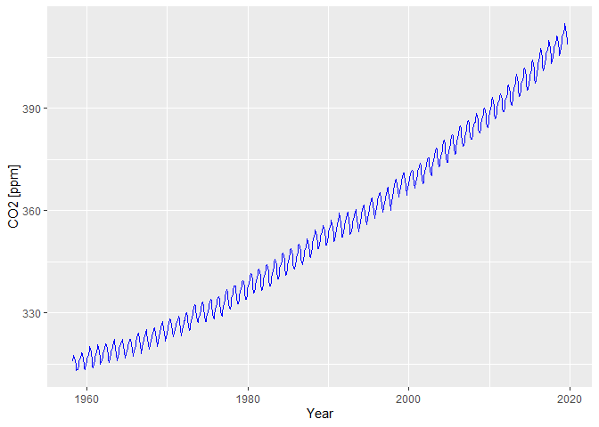

## CO2 Serie

Download data from:

Citation: C. D. Keeling, S. C. Piper, R. B. Bacastow, M. Wahlen, T. P. Whorf, M. Heimann, and H. A. Meijer, Exchanges of atmospheric CO2 and 13CO2 with the terrestrial biosphere and oceans from 1978 to 2000. I. Global aspects, SIO Reference Series, No. 01-06, Scripps Institution of Oceanography, San Diego, 88 pages, 2001. http://escholarship.org/uc/item/09v319r9


```sh
 [ -f ./download/monthly_in_situ_co2_mlo.csv ] && mv -f ./download/monthly_in_situ_co2_mlo.csv ./download/monthly_in_situ_co2_mlo.csv.bck
 wget -q -P download http://scrippsco2.ucsd.edu/assets/data/atmospheric/stations/in_situ_co2/monthly/monthly_in_situ_co2_mlo.csv
 sed -i '/^"/d' ./download/monthly_in_situ_co2_mlo.csv
 sed -i '2d;3d' ./download/monthly_in_situ_co2_mlo.csv
```

## Convert to standard format


```r
co2 <- read.csv("./download/monthly_in_situ_co2_mlo.csv", sep=",")
names(co2)[names(co2) == "Yr"] <- "year"
names(co2)[names(co2) == "Mn"] <- "month"
co2 <- subset(co2, -99 < co2$CO2)

co2new <-co2[,c("year","month","CO2")]
co2new$time <- signif(co2new$year + (co2new$month-0.5)/12, digits=6)

co2new <- co2new[order(co2new$time),]

write.table(co2new, file = "./csv/monthly_co2.csv", append = FALSE, quote = TRUE, sep = ",",
            eol = "\n", na = "NA", dec = ".", row.names = FALSE,
            col.names = TRUE, qmethod = "escape", fileEncoding = "UTF-8")
```

## Plot diagramm


```r
require("ggplot2")
```

```
## Loading required package: ggplot2
```

```r
co2 <- read.csv("./csv/monthly_co2.csv", sep=",")
mp <- ggplot() +
      geom_line(aes(y=co2$CO2, x=co2$time), color="blue") +
      xlab("Year") + ylab("CO2 [ppm]")
mp
```

<!-- -->
